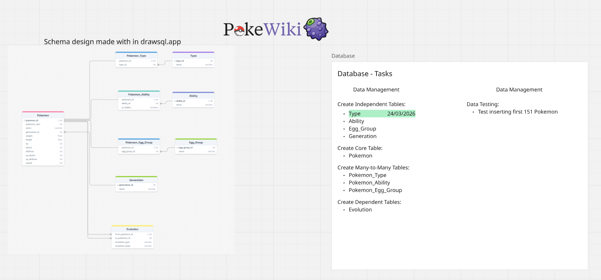
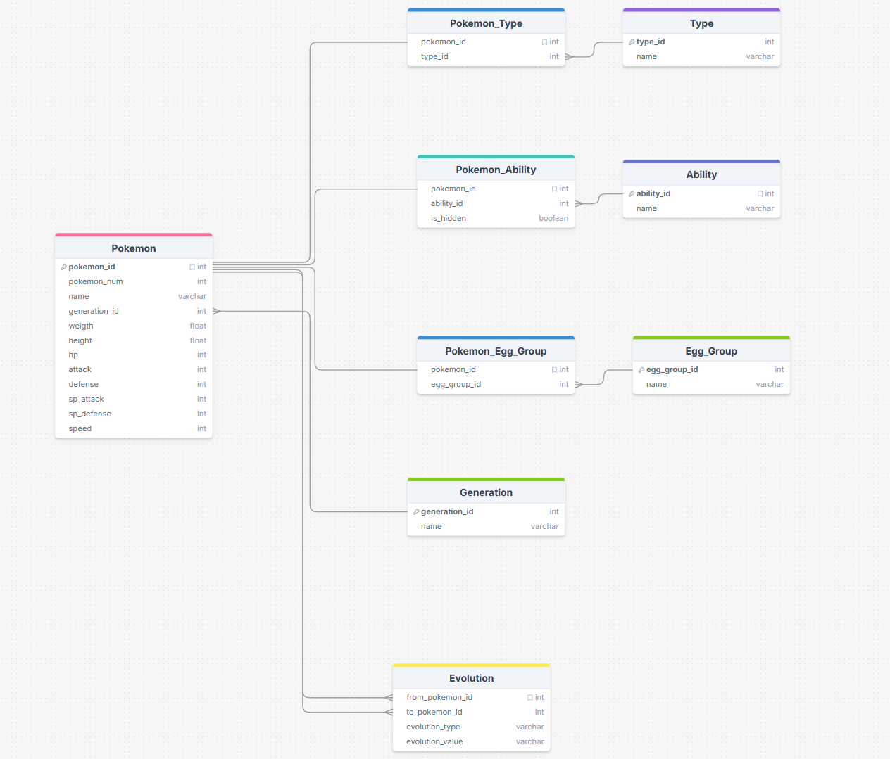

# Pokewiki Database 

This project contains the database infrastructure and initial schema for the Pokewiki application. It uses Docker to orchestrate PostgreSQL and pgAdmin.

## Technologies 🔧
* **Database:** PostgreSQL 15
* **Management:** pgAdmin 4
* **Containerization:** Docker & Docker Compose

## How to run 🏃‍♂️
To get the project up and running locally, follow these steps:

1. **Clone the repository:**
   ```bash
   git clone [https://github.com/seu-usuario/nome-do-repo.git](https://github.com/seu-usuario/nome-do-repo.git)
   cd nome-do-repo
   ```
   
2. **Start the containers**:

  ```powershell
  docker-compose up -d
  ```

3. **Access pgAdmin**:

- URL: http://localhost:8080

- Email: admin@admin.com

- Password: admin

📂 Project Structure

/sql: Contains all .sql scripts for database initialization.

docker-compose.yml: Docker configuration for the services.

🔑 Database Credentials

User: zago!
Password: secretpassword
Database: pokewiki
Port: 5432

## Creative Process ✏️

During the process of making this project I used many tools for making my project alive, and making easier to organize my thinking process, the tools I used was:

### Miro

For organizing my project and write down my own to-do list, organizing in a way that the DataBase System works fine.

EasterEgg -> The logo is a little joke with an actual berry in the games named Wiki Berry



### DrawSQL

An site for making an visual schema, I made one before setting up the PostgreSQL tables, this way I know exactly waht I'm going to do and help my to-do list in Miro

