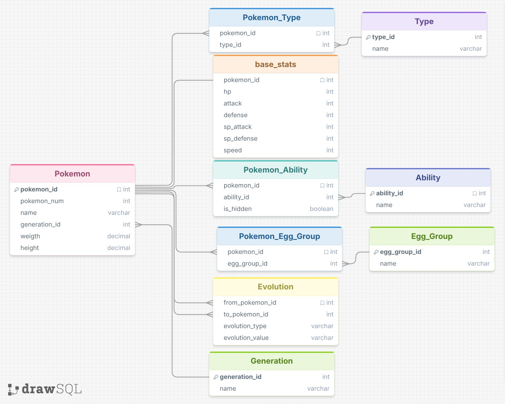
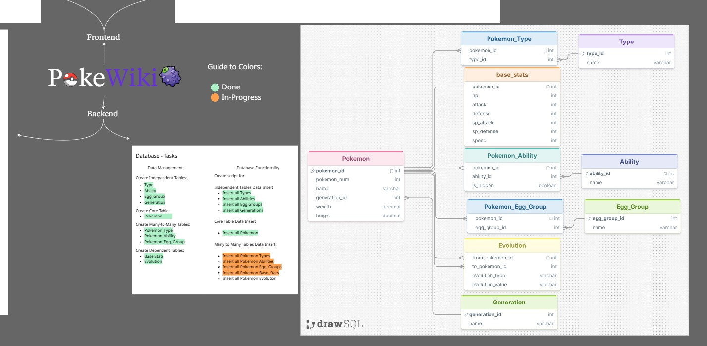

# PokeWiki | Fullstack Project

PokeWiki is an application designed to explore data modeling, containerization, and backend integration. The project focuses on building a scalable environment for managing Pokémon data, using the PokeAPI and infrastructure tools.

## Architecture & Infrastructure

The project is built with a focus on Environment Isolation and Data Integrity.

*   **Containerization:** The entire ecosystem uses Docker and Docker Compose, ensuring functionality across different development environments.

*   **Database:** Powered by PostgreSQL 15.

*   **Administration:** pgAdmin 4 is integrated into the Docker network for database monitoring and management.


## Data Modeling

A significant portion of this project was dedicated to the logical design phase before the code was written. This ensures that the database can handle complex relationships such as evolutions and multiple types per Pokémon.

### Database Schema (ERD)
The schema was planned in DrawSQL to handle:
*   **Many-to-Many Relationships:** Implemented for `Pokemon_Type` and `Pokemon_Ability` to ensure normalized data.

*   **Recursive Relationships:** Designed within the `Evolution` table to trakc complex evolution chains.

*   **Data Constraints:** Strict use of Foreign Key and Data Type to prevent inconsistency.



### Planning with Miro
I used Miro as a centralized planning space for project management. This includes:

*   Task Management: Tracking "In-Progress" and "Done" states for database initialization scripts.

*   System Mapping: Defining the communication flow between the Frontend, Server, and Database.

> **Easter Egg:** The project logo of the project features the Wiki Berry, an real in-game item.



---

## Getting Started

### Prerequisites

*   Docker & Docker Compose installed.

*   Git.

### Installation & Execution

1.  **Clone the repository:**

    ```bash
    git clone [https://github.com/zfirmo/PokeWiki](https://github.com/zfirmo/PokeWiki)
    cd PokeWiki
    ```

2.  **Spin up the Infrastructure:**

    ```bash
    docker-compose up -d
    ```

### Service Access & Credentials

| Service | URL | Credentials |
| :--- | :--- | :--- |
| **pgAdmin 4** | `http://localhost:8080` | `admin@admin.com` / `admin` |
| **PostgreSQL** | `localhost:5432` | `zago` / `secretpassword` |

**Note:** The database `pokewiki` is automatically initialized using the scripts located in the `/sql` directory.

## Project Structure
```text
├── /sql                # DDL and DML scripts for DB initialization
├── /images             # Documentation assets and diagrams
├── docker-compose.yml  # Infrastructure orchestration
└── README.md           # Project documentation